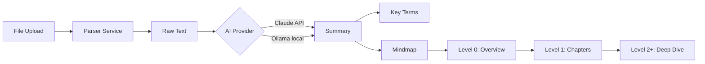

# pallas

AI-powered study companion and encrypted journal. Parses lecture notes (PDF, Word, PowerPoint, Excel, images via OCR, Markdown), generates smart summaries, explains key terms, and visualizes knowledge as interactive, zoomable mindmaps. Includes a fully encrypted, local-only AI journal for personal reflection.

**Work in Progress**

---

## Demo

> *Screenshots coming once the frontend is ready*

---

## Tech Stack

| Component | Technology |
|---|---|
| Backend | Python 3.13 · FastAPI · SQLAlchemy · SQLite |
| Frontend | React · TypeScript · Vite · Tailwind CSS |
| Mindmap | React Flow |
| AI | Claude API (Anthropic) · Ollama (local) |
| Parsing | PyMuPDF · python-docx · python-pptx · openpyxl · Tesseract OCR |

---

## Project Structure
```
studyAI/
├── backend/
│   ├── api/                # REST endpoints
│   │   ├── modules.py      # CRUD for study modules
│   │   ├── documents.py    # File upload & parsing
│   │   ├── summaries.py    # AI-generated summaries
│   │   └── mindmap.py      # Mindmap data
│   ├── services/           # Business logic
│   │   ├── ai_service.py   # Claude/Ollama switching
│   │   ├── parser_service.py # File parsing (7 formats)
│   │   └── mindmap_service.py
│   ├── models/             # Database models
│   │   ├── module.py       # Study module
│   │   ├── document.py     # Uploaded document
│   │   ├── summary.py      # AI summary
│   │   └── mindmap_node.py # Mindmap node
│   ├── infra/              # Configuration
│   │   └── config.py
│   └── main.py             # FastAPI entry point
├── frontend/               # React app (coming soon)
└── README.md
```

---

## Getting Started

### Prerequisites

- Python 3.12+
- Node.js 20+
- Git
- [Tesseract](https://github.com/tesseract-ocr/tesseract) (for OCR)

### Backend Setup
```bash
# Clone the repository
git clone https://github.com/NoahRolli/pallas.git
cd pallas

# Create and activate virtual environment
python3 -m venv .venv
source .venv/bin/activate

# Install dependencies
pip3 install -r backend/requirements.txt

# Start the server
uvicorn backend.main:app --reload
```

API documentation: [http://localhost:8000/docs](http://localhost:8000/docs)

### Frontend Setup (coming soon)
```bash
cd frontend
npm install
npm run dev
```

---

## Features

- [x] Create, edit, and delete study modules
- [x] File upload with automatic text extraction
- [x] Supported formats: PDF, Word, PowerPoint, Excel, Images (OCR), Markdown, TXT
- [ ] AI-powered summaries (Claude & Ollama)
- [ ] Key term explanations
- [ ] Interactive mindmap with zoom levels
- [ ] Frontend dashboard
- [ ] User authentication

---

## Content Pipeline


---

## CI/CD

> *GitHub Actions workflow coming soon*

---

## Versioning

This project follows [Semantic Versioning](https://semver.org/):
`v0.1.0` → `v0.2.0` → `v1.0.0`

---

## License

MIT
