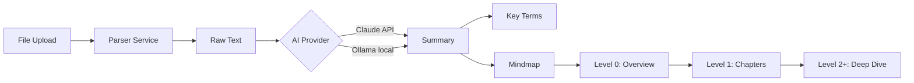
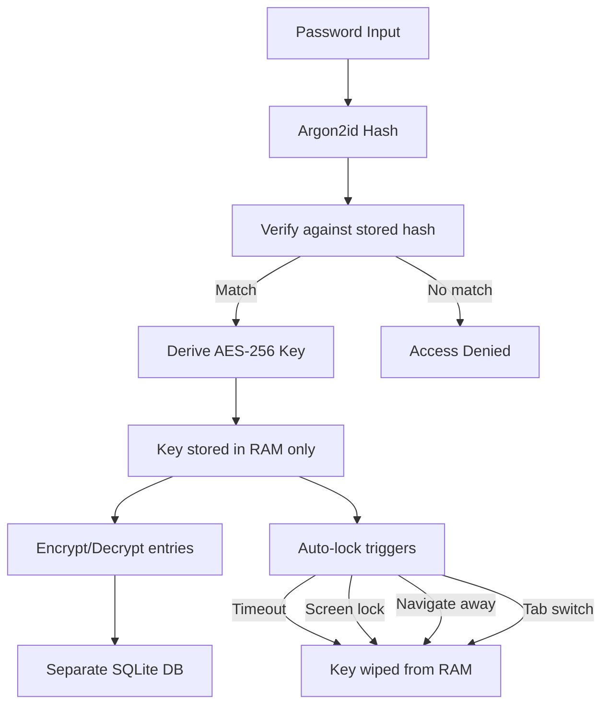

# Pallas

AI-powered study companion and encrypted journal. Parses lecture notes (PDF, Word, PowerPoint, Excel, images via OCR, Markdown), generates smart summaries, explains key terms, and visualizes knowledge as interactive, zoomable mindmaps. Includes a fully encrypted, local-only AI journal with mood tracking, medication tracker, and analytics.

**Work in Progress**

---

## Tech Stack

| Component | Technology |
|---|---|
| Backend | Python 3.14 · FastAPI · SQLAlchemy · SQLite |
| Frontend | React · TypeScript · Vite · Tailwind CSS v4 |
| Mindmap | React Flow (Tree + Neural layout) |
| Drag & Drop | @dnd-kit |
| AI (Study) | Claude API (Anthropic) · Ollama (local) — switchable |
| AI (Journal) | Ollama only — local, private, no external API |
| Parsing | PyMuPDF · python-docx · python-pptx · openpyxl · Tesseract OCR |
| Encryption | AES-256-GCM · Argon2id |
| Docs | Sphinx · Furo theme · GitHub Pages |

---

## Project Structure
```
pallas/
├── backend/
│   ├── main.py                        # FastAPI entry point
│   ├── requirements.txt
│   ├── infra/
│   │   └── config.py                  # Global settings (DB, AI, paths)
│   ├── api/
│   │   ├── modules.py                 # CRUD for study modules
│   │   ├── documents.py               # File upload & parsing
│   │   ├── summaries.py               # AI-generated summaries
│   │   ├── mindmap.py                 # Mindmap generation + deep dive
│   │   └── folders.py                 # Folder hierarchy + drag & drop
│   ├── services/
│   │   ├── parser_service.py          # File parsing (7 formats, PyMuPDF optional)
│   │   ├── ai_service.py              # Provider pattern (Claude/Ollama)
│   │   ├── claude_provider.py         # Claude API integration
│   │   ├── ollama_provider.py         # Ollama with robust JSON parser
│   │   └── mindmap_service.py         # Tree structure + deep dive
│   ├── models/
│   │   ├── database.py                # SQLAlchemy setup
│   │   ├── module.py                  # Study module (with folder_id)
│   │   ├── document.py                # Uploaded document
│   │   ├── summary.py                 # AI summary
│   │   ├── mindmap_node.py            # Mindmap node (hierarchical)
│   │   └── folder.py                  # Folder (self-referencing hierarchy)
│   └── journal/                       # Encrypted journal (isolated module)
│       ├── infra/
│       │   └── journal_config.py      # Journal-specific settings
│       ├── api/
│       │   ├── auth.py                # Password setup, unlock, lock
│       │   ├── entries.py             # Encrypted CRUD + auto-title
│       │   ├── schemas.py             # Pydantic schemas
│       │   ├── dependencies.py        # require_unlocked()
│       │   ├── analytics.py           # Mood, clusters, storylines
│       │   ├── medications.py         # Medication tracker CRUD + intake log
│       │   └── medication_schemas.py  # Medication Pydantic schemas
│       ├── services/
│       │   ├── password_service.py    # Argon2id hashing
│       │   ├── crypto_service.py      # AES-256-GCM encrypt/decrypt
│       │   ├── session_service.py     # Unlock/lock, key in RAM
│       │   ├── journal_ai_service.py  # Ollama-only AI + title generation
│       │   ├── embedding_service.py   # nomic-embed-text (local)
│       │   ├── mood_service.py        # Sentiment analysis
│       │   ├── clustering_service.py  # Topic clustering
│       │   └── storyline_service.py   # Narrative arc detection
│       └── models/
│           ├── journal_database.py    # Separate encrypted SQLite DB
│           ├── journal_entry.py       # Encrypted entry model
│           └── medication.py          # Encrypted medication + intake log
│
├── frontend/
│   ├── src/
│   │   ├── components/
│   │   │   ├── Layout.tsx             # App wrapper with HUD grid background
│   │   │   ├── Sidebar.tsx            # Navigation with glow effects
│   │   │   ├── DraggableCard.tsx      # Drag & drop wrapper (@dnd-kit)
│   │   │   ├── DroppableFolder.tsx    # Drop zone with glow feedback
│   │   │   └── journal/
│   │   │       ├── MoodChart.tsx      # recharts mood timeline
│   │   │       ├── ClusterView.tsx    # Topic cluster cards
│   │   │       ├── StorylineView.tsx  # Narrative arc visualization
│   │   │       ├── MedicationTracker.tsx  # Medication list + intake
│   │   │       └── MedicationForm.tsx # Medication create/edit form
│   │   ├── pages/
│   │   │   ├── Dashboard.tsx          # Folder hierarchy + drag & drop
│   │   │   ├── ModuleDetail.tsx       # Upload, summary, mindmap
│   │   │   ├── MindmapPage.tsx        # React Flow (Tree/Neural switch)
│   │   │   └── Journal.tsx            # Encrypted journal + analytics tabs
│   │   ├── hooks/
│   │   │   ├── useApi.ts             # API client (get, post, put, del)
│   │   │   └── useJournalLock.ts     # Auto-lock on navigate/visibility
│   │   ├── utils/
│   │   │   └── mindmapLayouts.ts     # Tree + Neural layout algorithms
│   │   ├── types/
│   │   │   └── models.ts             # TypeScript type definitions
│   │   ├── App.tsx                    # Router configuration
│   │   └── index.css                  # HUD theme (CSS variables, glow, Orbitron)
│   └── vite.config.ts
│
├── docs/                              # Sphinx documentation (auto-deploy)
├── .github/
│   ├── workflows/
│   │   ├── ci.yml                     # Ruff linting
│   │   └── docs.yml                   # Sphinx → GitHub Pages
│   └── dependabot.yml                 # Weekly security updates
└── README.md
```

---

## Getting Started

### Prerequisites

- Python 3.12+
- Node.js 20+
- Git
- [Tesseract](https://github.com/tesseract-ocr/tesseract) (for OCR)
- [Ollama](https://ollama.ai) (required for journal features)

### Backend Setup
```bash
git clone https://github.com/NoahRolli/pallas.git
cd pallas
python3 -m venv .venv
source .venv/bin/activate
pip3 install -r backend/requirements.txt --break-system-packages
uvicorn backend.main:app --reload
```

API docs: [http://localhost:8000/docs](http://localhost:8000/docs)

### Frontend Setup
```bash
cd frontend
npm install
npm run dev
```

Frontend: [http://localhost:5173](http://localhost:5173)

---

## Features

### Study Companion
- [x] Folder hierarchy with drag & drop (nested folders + modules)
- [x] File upload with automatic text extraction
- [x] Supported formats: PDF, Word, PowerPoint, Excel, Images (OCR), Markdown, TXT
- [x] AI-powered summaries (Claude & Ollama, switchable)
- [x] Interactive mindmaps with two layouts (Tree + Neural)
- [x] Deep dive: click leaf nodes to expand via AI
- [x] Breadcrumb navigation

### Encrypted Journal
- [x] AES-256-GCM encryption with Argon2id key derivation
- [x] Separate encrypted database (isolated from main app)
- [x] Auto-lock on navigate away, laptop close, tab switch
- [x] Auto-generated titles via Ollama
- [x] Inline editing of entries
- [x] Mood tracking via sentiment analysis (Ollama-only)
- [x] Topic clustering via local embeddings (nomic-embed-text)
- [x] Storyline detection across entries
- [x] Medication tracker (toggleable, encrypted, daily intake log)

### Design
- [x] Futuristic HUD theme with cyan glow effects
- [x] Orbitron font for headings
- [x] Glassmorphism cards with backdrop blur
- [x] Animated transitions and glow pulses
- [x] Custom scrollbar and selection styling

### Infrastructure
- [x] CI pipeline with GitHub Actions (ruff linting)
- [x] Sphinx documentation on GitHub Pages
- [x] Dependabot for weekly security updates
- [x] Automated backup script (3h interval via cron)

---

## Content Pipeline


## Journal Security Architecture


---

## Documentation

[https://noahrolli.github.io/pallas/](https://noahrolli.github.io/pallas/)

---

## License

MIT