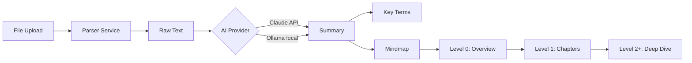
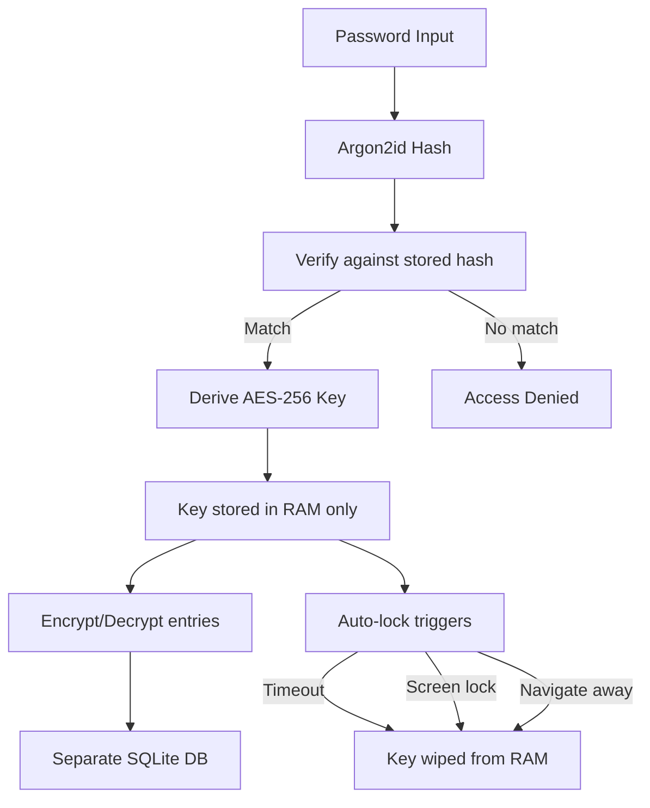

# Pallas

AI-powered study companion and encrypted journal. Parses lecture notes (PDF, Word, PowerPoint, Excel, images via OCR, Markdown), generates smart summaries, explains key terms, and visualizes knowledge as interactive, zoomable mindmaps. Includes a fully encrypted, local-only AI journal for personal reflection.

**Work in Progress**

---

## Demo

> *Screenshots coming once the frontend is ready*

---

## Tech Stack

| Component | Technology |
|---|---|
| Backend | Python 3.13 · FastAPI · SQLAlchemy · SQLite |
| Frontend | React · TypeScript · Vite · Tailwind CSS |
| Mindmap | React Flow |
| AI (Study) | Claude API (Anthropic) · Ollama (local) — switchable |
| AI (Journal) | Ollama only — local, private, no external API |
| Parsing | PyMuPDF · python-docx · python-pptx · openpyxl · Tesseract OCR |
| Encryption | AES-256-GCM · Argon2id |

---

## Project Structure
```
pallas/
├── backend/
│   ├── main.py                    # FastAPI entry point
│   ├── requirements.txt
│   │
│   ├── infra/
│   │   └── config.py              # Global settings (DB, AI, paths)
│   │
│   ├── api/                       # REST endpoints
│   │   ├── modules.py             # CRUD for study modules
│   │   ├── documents.py           # File upload & parsing
│   │   ├── summaries.py           # AI-generated summaries
│   │   └── mindmap.py             # Mindmap data
│   │
│   ├── services/                  # Business logic
│   │   ├── parser_service.py      # File parsing (7 formats)
│   │   ├── ai_service.py          # Claude/Ollama switching
│   │   ├── claude_provider.py     # Claude API integration
│   │   ├── ollama_provider.py     # Ollama integration
│   │   └── mindmap_service.py     # Mindmap structure builder
│   │
│   ├── models/                    # Database models
│   │   ├── database.py            # SQLAlchemy setup
│   │   ├── module.py              # Study module
│   │   ├── document.py            # Uploaded document
│   │   ├── summary.py             # AI summary
│   │   └── mindmap_node.py        # Mindmap node (hierarchical)
│   │
│   └── journal/                   # Encrypted journal (isolated module)
│       ├── infra/
│       │   └── journal_config.py  # Journal-specific settings
│       ├── api/
│       │   ├── auth.py            # Password setup, unlock, lock
│       │   ├── entries.py         # Encrypted CRUD
│       │   └── analytics.py       # Mood, clusters, storylines
│       ├── services/
│       │   ├── password_service.py    # Argon2id hashing
│       │   ├── crypto_service.py      # AES-256-GCM encrypt/decrypt
│       │   ├── session_service.py     # Unlock/lock, key in RAM
│       │   ├── journal_ai_service.py  # Ollama-only AI
│       │   ├── embedding_service.py   # nomic-embed-text (local)
│       │   ├── mood_service.py        # Sentiment analysis
│       │   ├── clustering_service.py  # Topic clustering
│       │   └── storyline_service.py   # Narrative arc detection
│       └── models/
│           ├── journal_database.py    # Separate encrypted SQLite DB
│           ├── journal_entry.py       # Encrypted entry
│           ├── journal_mood.py        # Mood scores
│           ├── journal_embedding.py   # Encrypted embeddings
│           ├── journal_cluster.py     # Topic clusters
│           └── journal_storyline.py   # Detected storylines
│
├── frontend/                      # React app
│   ├── src/
│   │   ├── components/
│   │   │   ├── Layout.tsx         # App wrapper with sidebar
│   │   │   └── Sidebar.tsx        # Navigation sidebar
│   │   ├── pages/
│   │   │   ├── Dashboard.tsx      # Module overview with CRUD
│   │   │   └── Journal.tsx        # Encrypted journal UI
│   │   ├── hooks/
│   │   │   └── useApi.ts          # API client for backend
│   │   ├── types/
│   │   │   └── models.ts          # TypeScript type definitions
│   │   ├── App.tsx                # Router configuration
│   │   └── main.tsx               # Entry point
│   └── vite.config.ts
├── .github/workflows/ci.yml      # CI pipeline (ruff + pytest)
└── README.md
```

---

## Getting Started

### Prerequisites

- Python 3.12+
- Node.js 20+
- Git
- [Tesseract](https://github.com/tesseract-ocr/tesseract) (for OCR)
- [Ollama](https://ollama.ai) (optional, required for journal features)

### Backend Setup
```bash
# Clone the repository
git clone https://github.com/NoahRolli/pallas.git
cd pallas

# Create and activate virtual environment
python3 -m venv .venv
source .venv/bin/activate

# Install dependencies
pip3 install -r backend/requirements.txt

# Start the server
uvicorn backend.main:app --reload
```

API documentation: [http://localhost:8000/docs](http://localhost:8000/docs)

### Frontend Setup
```bash
cd frontend
npm install
npm run dev
```

Frontend runs at [http://localhost:5173](http://localhost:5173)

---

## Features

### Study Companion
- [x] Create, edit, and delete study modules
- [x] File upload with automatic text extraction
- [x] Supported formats: PDF, Word, PowerPoint, Excel, Images (OCR), Markdown, TXT
- [x] AI-powered summaries (Claude & Ollama, switchable)
- [x] Mindmap generation with deep dive
- [ ] Key term explanations
- [ ] Interactive mindmap frontend (React Flow)

### Encrypted Journal
- [x] AES-256-GCM encryption with Argon2id password hashing
- [x] Separate encrypted database (isolated from main app)
- [x] Session management with auto-lock timeout
- [x] Encrypted CRUD for journal entries
- [x] Password setup, unlock, lock via API
- [x] Frontend with setup, unlock and entry management
- [ ] Mood tracking via sentiment analysis (Ollama-only)
- [ ] Topic clustering via local embeddings (nomic-embed-text)
- [ ] Storyline detection across entries
- [ ] Timeline visualization

### Frontend
- [x] React + TypeScript + Vite + Tailwind CSS
- [x] Dashboard with module CRUD
- [x] Journal with encryption flow (setup/unlock/entries)
- [x] Sidebar navigation with routing
- [ ] Module detail page (documents + summaries)
- [ ] Mindmap visualization page

### General
- [x] CI pipeline with GitHub Actions (ruff linting)
- [x] Sphinx documentation on GitHub Pages
- [ ] User authentication
- [ ] Deployment

---

## Content Pipeline


## Journal Security Architecture


---

## CI/CD

Automated pipeline runs on every push to `main` and on pull requests:
- **Linting** with [ruff](https://github.com/astral-sh/ruff)
- **Tests** with pytest (coming soon)

---

## Documentation

Full documentation is auto-generated from docstrings and deployed to GitHub Pages:
[https://noahrolli.github.io/pallas/](https://noahrolli.github.io/pallas/)

---

## Versioning

This project follows [Semantic Versioning](https://semver.org/):
`v0.1.0` → `v0.2.0` → `v1.0.0`

---

## License

MIT
